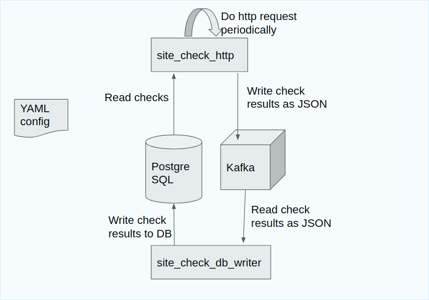

# site_checker
Basic site reliability checker for aiven





# how to run site_checker tests in Vagrant

1. Install Vagrant using instrucations
https://www.vagrantup.com/docs/installation

2. Install Virtual box or other VM provider

1. Clone repo:

```
git clone https://github.com/drednout/site_checker
cd site_checker/src
```

3. Setup vagrant env with provision from this repo:
```
vagrant up --provision
```

4. Go to VM, run tests

```
vagrant ssh
cd site_checker
source venv3.8/bin/activate
python tests/run_func_tests.py
```


# how to run site_checker manually as a service

1. Clone repo:

```
git clone https://github.com/drednout/site_checker
cd site_checker/src
```

2. Create virtualenv, install dependencies:

```
python3.8 -m venv venv3.8
source venv3.8/bin/activate
pip install -r .meta/packages
```

3. Copy config examples to some directory:

`cp -r config_example config_local`

4. Link migration config to DB migration dir:

``
ln -sf `pwd`/config_test/migrations.yml site_checker_db
``

5. Put private key and DB/Kafka settings into config_local
6. Run site_checker under supervisor:
```
supervisord -c config_local/supervisord.conf
```
